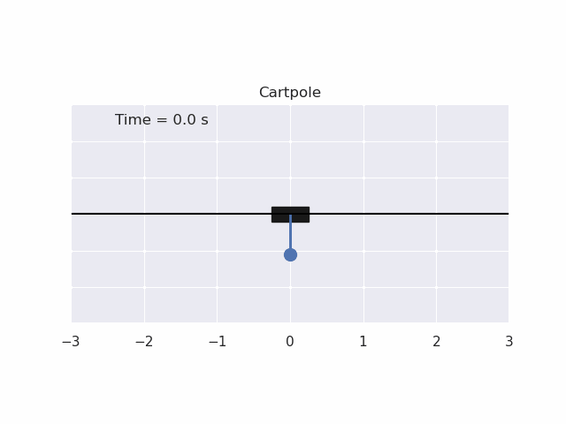
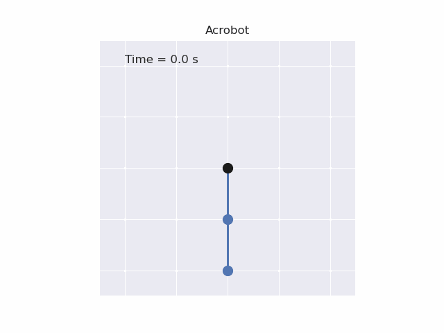

# iLQR
Non-linear trajectory optimization via Differential Dynamic Programming with the iLQR/DDP algorithm.

Differential Dynamic Programming (DDP) is an indirect method which optimizes over the unconstrained control-space. It uses a 2nd-order Taylor series approximation of the cost-to-go in Dynamic Programming (DP) to compute Newton steps on the control trajectory.

* iLQR:  Only keeps the first-order terms (Gauss-Newton approximation), which is similar to Riccati iterations, but accounts for the regularization and line-search required to handle the nonlinearity.
* DDP: Second-order terms included (Newton approximation).

The controller solves the following finite-horizon optimization problem:

$$ \begin{align*} 
\min_{x_{1:N},u_{1:N-1}} \quad & \sum_{i=1}^{N-1} \bigg[ \frac{1}{2} (x_i - {x}_{ref})^TQ({x}_i - {x}_{ref}) + \frac{1}{2} u_i^TRu_i \bigg] + \frac{1}{2}(x_N- {x}_{ref})^TQ_f
({x}_N- {x}_{ref})\\
 \text{st} \quad & x_1 = x_{\text{IC}} \\
 & x_{i+1} = f(x_i, u_i)  \quad \text{for } i = 1,2,\ldots,N-1  
 \end{align*}$$


<br>

 ### Cartpole

 <p align="center" width="100%">
    
</p>

### Acrobot

 <p align="center" width="100%">
    
</p>

<br>

Technologies
------------
The project was created with:
* Python 3.9
* jax 0.3.25
* numpy 1.24.2
* matplotlib 3.6.2
* seaborn 0.12.2

Installation
------------

To use this project, install it locally via:
```
git clone https://github.com/elena-ecn/SpaceX-Dragon-mpc.git
```

The dependencies can be installed by running:
```
pip install -r requirements.txt
```

To execute the code, run:
```
python3 main.py
```

License
-------
The contents of this repository are covered under the [MIT License](LICENSE).
